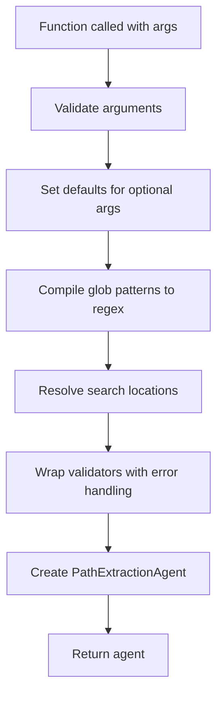
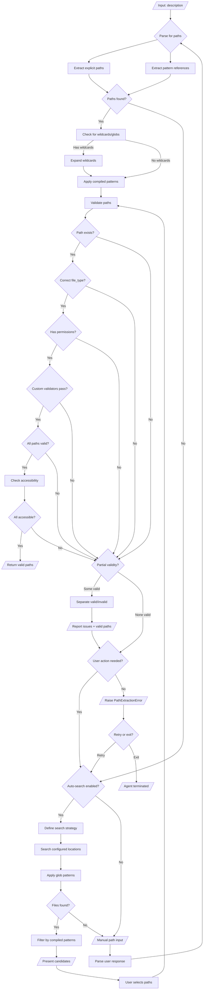

# Agent Designs

## `PathExtractionAgent`

### Overview
A generic agent for extracting and validating file system paths from text descriptions. Uses a factory function to pre-configure validation rules, allowing the agent to be reused efficiently with the same configuration. The execution flow is:

```python
create_path_extraction_agent(**kwargs) → PathExtractionAgent → extract(description) → list[Path]
```

### 2. `create_path_extraction_agent`

Creates configured `PathExtractionAgent` instances.

### Function Signature

```python
from pathlib import Path
from ..typings import FileType, FilePermission, ValidationResult

def create_path_extraction_agent(
    patterns: Sequence[str],
    types: Sequence[FileType] | None = None,
    permissions: Sequence[FilePermission] | None = None,
    validators: Sequence[Callable[[Path], ValidationResult]] | None = None,
    search_locations: Sequence[Path] | None = None,
    search_depth: int = 3,
    auto_search: bool = True,
    interactive: bool = True,
) -> PathExtractionAgent:
    """
    Create a configured path extraction agent.

    Args:
        patterns: Glob patterns to match files (e.g., ["*.ms", "*.MS"])
        types: Acceptable file types (default: ["any"])
        permissions: Required permissions (default: ["read"])
        validators: Custom validation functions returning ValidationResult
        search_locations: Directories to search (default: [cwd, ~/data])
        search_depth: Max recursion depth for search (default: 3)
        auto_search: Enable automatic search when no paths found (default: True)
        interactive: Enable user prompts (default: True)

    Returns:
        Configured PathExtractionAgent instance

    Raises:
        ValueError: If configuration is invalid

    Examples:
        >>> agent = create_path_extraction_agent(
        ...     patterns=["*.ms"],
        ...     types=["directory"],
        ...     permissions=["read"]
        ... )
        >>> paths = agent.extract("Process NGC1234 observations")
    """
```

### Parameters

#### **`patterns: Sequence[str]`** (Required)
- **Type:** Non-empty sequence of glob patterns
- **Purpose:** File patterns to match against
- **Examples:** `["*.ms", "*.MS"]`, `["*.h5", "*.hdf5"]`, `["*.fits"]`
- **Validation:**
  - Must contain at least one pattern
  - Each pattern must be non-empty string
  - Patterns can contain wildcards: `*`, `?`, `[...]`
  - Patterns can contain regex

#### **`types: Sequence[FileType] | None = None`**
- **Type:** Literal of `FileType` values
- **Purpose:** Acceptable file system object types
- **Default:** `["any"]`
- **Values:** `"file"`, `"directory"`, `"symlink"`, `"any"`
- **Example:** `["file"]` for regular files only

#### **`permissions: Sequence[FilePermission] | None = None`**
- **Type:** Literal of `FilePermission` values
- **Purpose:** Required access permissions (very specific)
- **Default:** `["read"]`
- **Values:** `"read"`, `"write"`, `"execute"`
- **Example:** `["read", "write"]` for read-write access

#### **`validators: Sequence[Callable[[Path], ValidationResult] | None = None`**
- **Type:** Optional sequence of custom validator functions
- **Signature:** Each validator takes a `Path` and returns `ValidationResult`
- **Purpose:** Domain-specific validation beyond basic filesystem checks
- **Default:** `None` (no custom validators)
- **Example:**
  ```python
  def validate_ms_structure(path: Path) -> tuple[bool, str]:
      required_tables = ["ANTENNA", "FIELD", "MAIN"]
      missing = [table for table in required_tables if not (path / table).exists()]
      if missing:
          return ValidationResult(value=False, error_message=f"Missing tables: {', '.join(missing)}")
      return ValidationResult(value=True)

  agent = create_path_extraction_agent(
      patterns=["*.ms"],
      validators=[validate_ms_structure]
  )
  ```

#### **`search_locations: Sequence[Path] | None = None`**
- **Type:** Optional sequence of `Path` objects
- **Purpose:** Directories to search when auto-search is triggered
- **Default:** `[Path.cwd(), Path.home() / "data"]`
- **Example:** `[Path("/data/observations"), Path("/archive")]`

#### **`search_depth: int = 3`**
- **Type:** Integer ≥ 0
- **Purpose:** Maximum directory recursion depth for auto-search
- **Default:** `3`
- **Example:** `search_depth=5` for deeper searches

#### **`auto_search: bool = True`**
- **Type:** Boolean
- **Purpose:** Enable/disable automatic search when no paths found in description
- **Default:** `True`

#### **`interactive: bool = True`**
- **Type:** Boolean
- **Purpose:** Enable/disable interactive user prompts
- **Default:** `True`
- **Note:** Set to `False` for batch processing or automated pipelines


### Factory Implementation Flow



---

## 2. `PathExtractionAgent`

Lightweight, immutable agent that extracts and validates paths from descriptions.

### Responsibilities
1. Parse description for paths
2. Apply pre-compiled validation rules
3. Execute search if needed
4. Return validated paths

Use `pydantic_graph` to implement this agent with the use of other tools and agents in the codebase, e.g. `agents/`, `tools/` prepose new agents or tools we could make, whether specific general.

### Agent Execution Flow



---

## Usage Examples

### Example 1: Radio Astronomy Measurement Sets

```python
from pathlib import Path
from .typings import ValidationResult
from .agents.extraction.path import create_path_extraction_agent

# Define custom validator
def validate_ms_structure(path: Path) -> ValidationResult:
    required = ["ANTENNA", "FIELD", "MAIN"]
    missing = [t for t in required if not (path / t).exists()]
    return ValidationResult(value=(not missing), error_message=f"Missing: {missing}" if missing else None)

# Create agent (do this once)
path_agent = create_path_extraction_agent(
    patterns=["*.ms", "*.MS"],
    types=["directory"],
    permissions=["read"],
    validators=[validate_ms_structure],
    search_locations=[Path("/data/observations"), Path("/archive")]
)

# Use agent multiple times (lightweight calls)
paths1 = path_agent("Calibrate NGC1234 X-band observations")
paths2 = path_agent("Process all data from project VLA2024A")
paths3 = path_agent("Find measurement sets from yesterday")
```

### Example 2: Machine Learning Datasets with Multiple Agents

```python
# Agent for training data
train_agent = create_path_extraction_agent(
    patterns=["*train*.h5", "*train*.hdf5"],
    types=["file"],
    permissions=["read"],
    search_locations=[Path("./data/train")]
)

# Agent for validation data
val_agent = create_path_extraction_agent(
    patterns=["*val*.h5", "*valid*.h5"],
    types=["file"],
    permissions=["read"],
    search_locations=[Path("./data/val")]
)

# Use both agents
train_paths = train_agent("Load training data from last week")
val_paths = val_agent("Load validation set")
```

### Example 3: Non-Interactive Batch Processing

```python
agent = create_path_extraction_agent(
    patterns=["*.log"],
    types=["file"],
    permissions=["read"],
    auto_search=True,
    interactive=False,  # No user prompts in batch mode
    search_locations=[Path("/var/log/myapp")]
)

try:
    paths = agent("Find error logs from today")
    process_logs(paths)
except PathExtractionError as e:
    logger.error(f"Failed to find logs: {e.message}")
```

### Example 4: Simple Case with Minimal Configuration

```python
# Most parameters have sensible defaults
agent = create_path_extraction_agent(
    patterns=["*.txt", "*.md"]
)

# Uses default: types=["any"], permissions=["read"]
# Auto-search in current directory and ~/data
docs = agent("Find my notes about the meeting")
```

### Example 6: Strict Validation for Critical Files

```python
def validate_config_schema(path: Path) -> tuple[bool, str]:
    """Validate YAML config has required fields."""
    import yaml
    try:
        with open(path) as f:
            config = yaml.safe_load(f)
        required = ["database", "api_key", "timeout"]
        missing = [k for k in required if k not in config]
        if missing:
            return False, f"Missing required fields: {missing}"
        return True, "Valid config"
    except Exception as e:
        return False, f"Invalid YAML: {e}"

agent = create_path_extraction_agent(
    patterns=["config.yaml", "*.config.yml"],
    types=["file"],
    permissions=["read"],
    validators=[validate_config_schema],
    auto_search=False  # Config must be explicitly specified
)

config_paths = agent("Use the production config")
```

---

## Implementation Notes

### Path Parsing Strategy
1. **Regex patterns** to detect absolute paths: `r'(?:/|[A-Z]:\\)[^\s]+'`
2. **Regex patterns** to detect relative paths: `r'(?:\./|\.\./)[\w/.-]+'`
3. **Environment variable expansion**: Replace `$VAR` and `${VAR}`
4. **Tilde expansion**: Replace `~` with home directory
5. **Glob pattern detection**: Check for `*`, `?`, `[...]` characters

### Validation Order
The validation cascade should short-circuit on first failure:
1. Path existence check (`path.exists()`)
2. File type check (`path.is_file()`, `path.is_dir()`, etc.)
3. Permission check (`os.access(path, mode)`)
4. Custom validators (in sequence order)

### Search Strategy
When auto-search is triggered:
1. Extract keywords from description (nouns, proper nouns, dates)
2. Build search patterns combining `patterns` with keywords
3. Search `search_locations` up to `search_depth` recursion
4. Rank candidates using `ranking_weights`
5. If `interactive=True`, present top 5 candidates for selection
6. If `interactive=False`, automatically select top candidate

### Error Handling
- All file I/O operations wrapped in try-except
- Permission errors logged with specific file path
- Corrupted files caught and reported separately
- Network paths timeout after 5 seconds

---

## Performance Considerations

- **Factory function**: O(p) where p = number of patterns (compiled once)
- **Path parsing**: O(n) where n = description length
- **Glob expansion**: O(m) where m = number of matching files
- **Validation**: O(k × v) where k = paths, v = validators
- **Search**: O(d × f) where d = depth, f = files per directory

**Optimization strategies:**
- Pattern compilation happens once in factory
- Parallel validation for independent paths
- Early termination when sufficient valid paths found
- Caching of file metadata during ranking
- Lazy evaluation of glob patterns

---

## Security Considerations

- **Path traversal**: Validate paths don't escape allowed directories
- **Symlink attacks**: Optionally resolve symlinks before validation
- **Permission escalation**: Never suggest running with elevated privileges
- **Input sanitization**: Escape shell-special characters in paths
- **Injection prevention**: Sandboxed validator execution with timeouts
- **Factory validation**: All arguments validated before agent creation